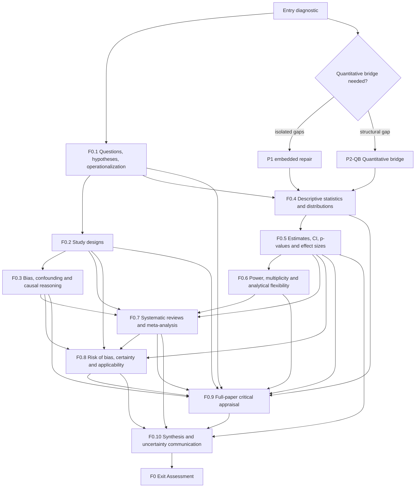

# F0 — PREREQUISITE GRAPH

**State:** `ARCHITECTED`

This file defines conceptual dependencies for F0. It is not a calendar. A unit can be produced before a learner has studied every predecessor, but learning validation must respect the dependencies below.

## 1. Dependency graph

## 2. Dependency semantics

### P0 — local definitions

P0 terms may be introduced at point of use and do not require a separate lesson. Examples across F0:

- population, sample, variable, exposure, intervention, comparator, outcome;
- estimate, parameter, bias, validity, confounder;
- effect measure, confidence interval, alpha, beta, power;
- heterogeneity, risk-of-bias domain, certainty, applicability.

A P0 is satisfied only when the term is explicitly defined in the lesson where it first becomes necessary.

### P1 — embedded support

P1 concepts require a short subsection, worked example or micro-exercise. Typical F0 P1s:

- within-subject versus between-subject comparisons;
- simple probability complements;
- ratio and percentage reasoning;
- reading forest plots and logarithmic ratio scales;
- simple directed causal graphs;
- separating percentage change from percentage-point change;
- extracting PICO/estimand information from an article.

If repeated failure shows that a P1 is actually a structural gap, it must be promoted to P2 for that learner rather than repeatedly patched.

### P2 — structural dependencies

The following dependencies are structural:

| Target | Required P2 before learner validation |
|---|---|
| F0.2 | F0.1 |
| F0.3 | F0.1 + F0.2 |
| F0.4 | F0.1 + conditional P2-QB if diagnostic fails |
| F0.5 | F0.4 |
| F0.6 | F0.4 + F0.5 |
| F0.7 | F0.2 + F0.5 + F0.6; F0.3 required before formal risk-of-bias interpretation |
| F0.8 | F0.2 + F0.3 + F0.5 + F0.7 |
| F0.9 | F0.1–F0.8 |
| F0.10 | F0.5 + F0.7 + F0.8 + F0.9 |
| Exit assessment | F0.1–F0.10 |

## 3. Quantitative bridge (`P2-QB`)

`P2-QB` is conditional because F0 should not assume either advanced mathematics or complete numeracy.

Promote the bridge to P2 when the learner cannot reliably:

1. convert fractions, decimals and percentages;
2. calculate absolute and relative change;
3. distinguish percentage from percentage points;
4. rearrange a one-step equation;
5. interpret a ratio;
6. read a table and x/y graph correctly;
7. identify mean versus median in a simple example;
8. interpret probability on a 0–1 or 0–100% scale.

The bridge does **not** need calculus or proof-based statistics. Its purpose is to remove arithmetic opacity before inferential concepts begin.

## 4. Parallel production versus learning order

Content production may proceed nonlinearly, but learner states must not violate dependencies. For example:

- F0.7 can be drafted before F0.6 is studied;
- a learner should not be marked `APPLIED` in F0.7 if multiplicity, uncertainty and effect measures remain structurally misunderstood;
- F0.9 is intentionally integrative and cannot be validated by isolated terminology recall.

## 5. Remediation routing

Observed errors should route backward to the earliest broken dependency:

- cannot interpret CI width → retest F0.4 sampling variation before reteaching F0.5 wording;
- calls observational association causal solely because covariates were adjusted → return to F0.2/F0.3;
- treats `p > 0.05` as proof of no effect → return to F0.5, then F0.6 if power/precision is also misunderstood;
- treats low I² as proof all studies are equivalent → return to F0.7 heterogeneity;
- uses PRISMA/CONSORT score as study quality → return to F0.8 distinction between reporting and risk of bias;
- communicates a low-certainty estimate as definitive → return to F0.8 then F0.10.

## 6. Exit gate dependency rule

A high total score cannot compensate for a structural failure in causal reasoning, quantitative uncertainty or evidence certainty. `ASSESSMENT_BLUEPRINT.md` defines the critical-fail conditions and scoring gate.